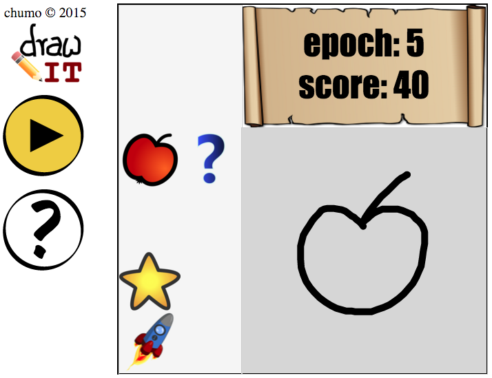

DrawIT
------

This is a *tetris-like* game written in javascript (d3 web app) using a machine learning algorithm (random forest) to identify handwritten paths.

### Screen shot

### Libraries
- [d3.js](https://d3js.org)
- [randomforest.js](https://github.com/karpathy/forestjs)

### License
GNU GENERAL PUBLIC LICENSE v3.0 (see [LICENSE](LICENSE) file).

Enjoy!

Jesús Martínez-Blanco
